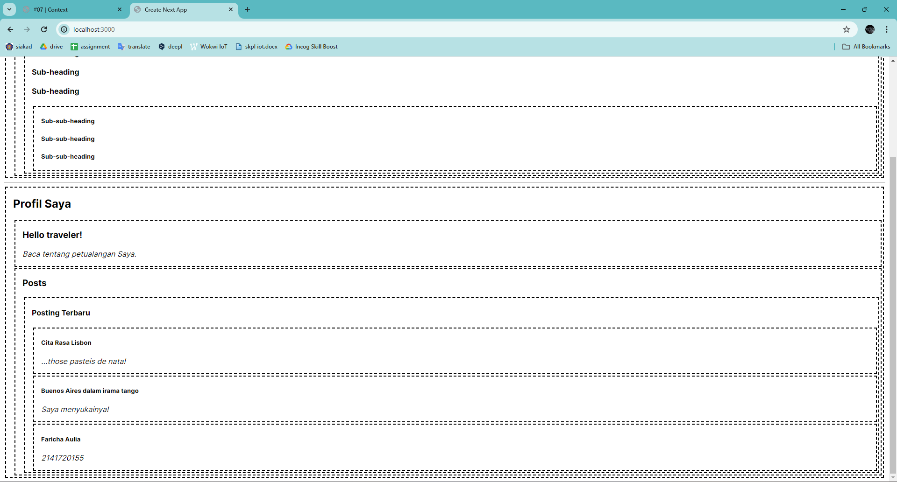
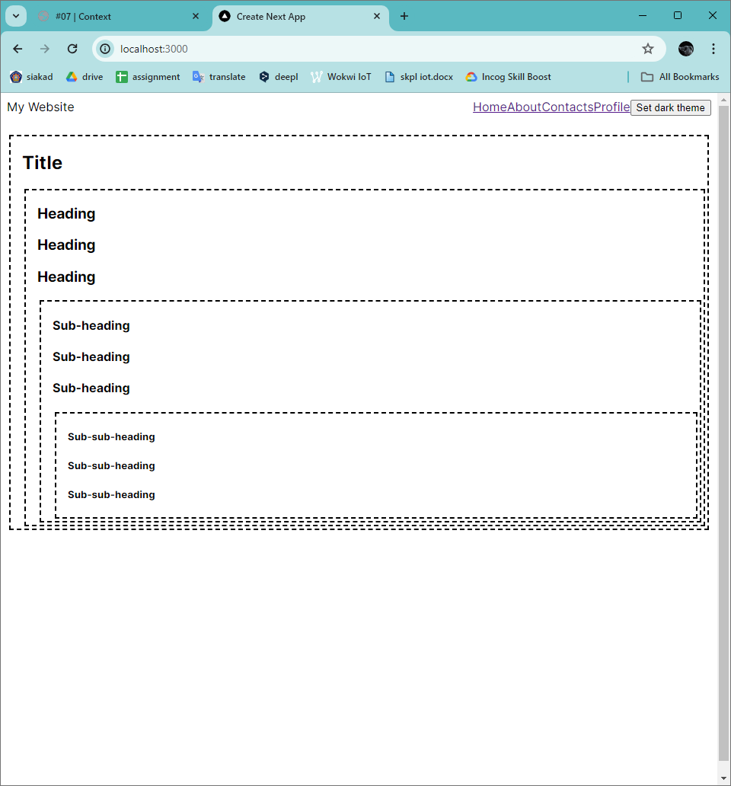

# Laporan Praktikum
| MatKul | Pemrograman Berbasis Framework |
| ---    | ---           |
| Nama   | Faricha Aulia |
| NIM    | 2141720155    |
| Kelas  | TI - 3I       |

<table><tr><td>Saya melampirkan screenshot dari setiap step yang saya lakukan pada src/assets</td></tr></table>

## Pertanyaan 1 dan Jawaban
> "Capture hasilnya dan jelaskan apa yang telah Anda pelajari dan bagaimana tampilannya saat ini?!"

**Yang saya pelajari :** 
Saya belajar tentang penggunaan context untuk menyediakan data ke komponen-komponen di dalam pohon (tree) komponen. Selain itu, saya juga mempelajari prinsip atomic design yang membantu dalam strukturisasi komponen-komponen menjadi bagian-bagian yang lebih kecil dan mudah dikelola.

---

## Pertanyaan 2 dan Jawaban
> "Capture hasilnya dan buatlah laporan di README.md. Jelaskan apa yang telah Anda pelajari dan bagaimana tampilannya saat ini? Jika terjadi error, silakan perbaiki, Mengapa hal itu bisa terjadi? Jelaskan!"

**Error dan penyelesaiannya :**
Error tersebut terjadi karena NextJS membagi komponen menjadi dua jenis: Client Component dan Server Component. Secara default, semua komponen saya dianggap sebagai Server Component. Jadi, saya perlu menandai bahwa komponen heading.tsx dan section.tsx adalah Client Component karena mereka menggunakan hook useContext yang hanya dapat digunakan pada Client Component.

**Yang saya pelajari :**
Setelah mengatasi error tersebut, tampilan aplikasi saat ini masih sama seperti sebelumnya. Semua judul dalam satu Section memiliki ukuran yang sama tanpa perlu mengoper prop level ke setiap komponen Heading secara terpisah. Penggunaan context memungkinkan komponen Heading untuk "mengetahui" level Section terdekat di atasnya, sehingga mengatur ukuran teks secara dinamis sesuai dengan konteksnya.

---

## Pertanyaan 3 dan Jawaban
> "Capture hasilnya dan buatlah laporan di README.md. Jelaskan apa yang telah Anda pelajari dan bagaimana tampilannya saat ini?"

**Yang saya pelajari :**
- Perubahan pada komponen Section, dapat menyediakan dan menggunakan context dari komponen yang sama tanpa perlu menentukan setiap level section secara manual. Dimana dapat membaca level dari Section di atasnya dan mengoper level + 1 ke bawah secara otomatis.
- Dengan demikian, baik komponen Heading maupun Section sekarang membaca LevelContext untuk mengetahui seberapa "dalam" mereka. Komponen Section juga membungkus anak-anaknya ke dalam LevelContext, sehingga menentukan bahwa apa pun yang ada di dalamnya berada pada level yang "lebih dalam".

**Tampilan saat ini :**
Tetap sama dengan sebelumnya, namun peningkatan ini memungkinkan manajemen level Section menjadi lebih dinamis dan otomatis, tanpa perlu menentukannya secara manual. 

--- 

## Pertanyaan 4 dan Jawaban
> "Capture hasilnya dan buatlah laporan di README.md. Tambahkan teks Nama dan NIM pada bagian komponen Post agar menunjukkan itu hasil kerja Anda!"

**Yang saya pelajari :**
Mempelajari tentang bagaimana context dapat melewati komponen perantara dalam pohon komponen. Dengan menyediakan context di tingkat tertentu dalam hierarki komponen, komponen-komponen di bawahnya dapat menggunakan context tersebut tanpa perlu penyesuaian khusus.

---

## Pertanyaan 5 dan Jawaban 
> "Silakan save semua dan lakukan running di browser Anda. Capture hasilnya dan buatlah laporan di README.md. Tambahkan teks Nama dan NIM pada setiap page routing agar menunjukkan itu hasil kerja Anda sendiri!
a. Apakah toggle button tema sudah berfungsi ? jika belum, silakan perbaiki!
b. Mengapa ketika refresh atau berpindah halaman tema tidak permanen ? Buatlah menjadi permanen walaupun page sudah direfresh dan pindah halaman!"

**Jawaban 5.a :**
Ya, Toogle Berfungsi

**Jawaban 5.b :**
- Ketika merefresh atau berpindah halaman, tema tidak tetap karena informasi tentang tema tersebut tidak tersimpan secara permanen di aplikasi.
- Untuk membuat tema website menjadi permanen, bahkan setelah refresh atau perpindahan halaman, dapat menggunakan localStorage atau cookies pada browser. Saya menggunakan localStorage

<video controls src="src/assets/03-26.mp4" title="Hasil akhir (Tema permanen)"></video>

---
